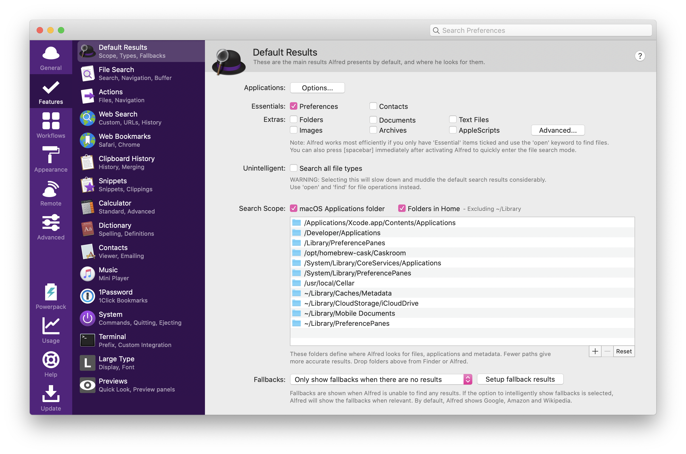

# Introduction
The productive MacOS configuration, use less apps to do more things.

*For Programmers: All scripts are stored in [willbchang/macos](https://github.com/willbchang/macos).*

## System Preferences
Enable its essence and disable its dross.

They can be enabled/disabled in two ways -- [GUI](https://en.wikipedia.org/wiki/Graphical_user_interface) and [CLI](https://en.wikipedia.org/wiki/Command-line_interface) for general users and hackers, several features can only be enabled/disabled from CLI.

Most of them are in `System Preferences` and stored as plist files in `~/Library/Preferences/`.

## File Management
Control the files without mess.
- Reorder the file structure and find the file/folder in 3 steps.
- Backup files/folders.
- Have enough storage in most situations.
  

## Text Editing
Type/Change text fast and efficiently.
- The right gesture of fingers.
- Native shortcuts.
- Plain Text with markup language.
- Text Editor with its shortcuts.
- Text Snippets
- Vim & Vim emulator  
- Regular Expression

## Automation & Browser Extensions
Make daily things easier.
- Alfred
  
- Browser Extensions
- Firefox Developer Edition(For Developer)

## Personal Management
Build a suitable workflow for personal management.
- Project Management
- Time Management
- Money Management
- Password Management
- Reading Workflow

## Unified Shortcuts
Memorise less shortcuts.
- Basic Shortcuts
- Global Shortcuts
- Unified shortcuts for similar features 

## Programming Setups
Introduction the core features of the best apps to improve the productivity.
- IDE
- Version Control
- Code Hosting
- Terminal Apps
- VPN

<!--
## Body Gesture and Relaxing
- Alexander Technique
## Music Composition
- EarMaster 7
- Dorico 3.5
-->

---
 This work is licensed under a <a rel="license" href="http://creativecommons.org/licenses/by-nc-nd/3.0/">Creative Commons Attribution-NonCommercial-NoDerivs 3.0 Unported License</a>.
