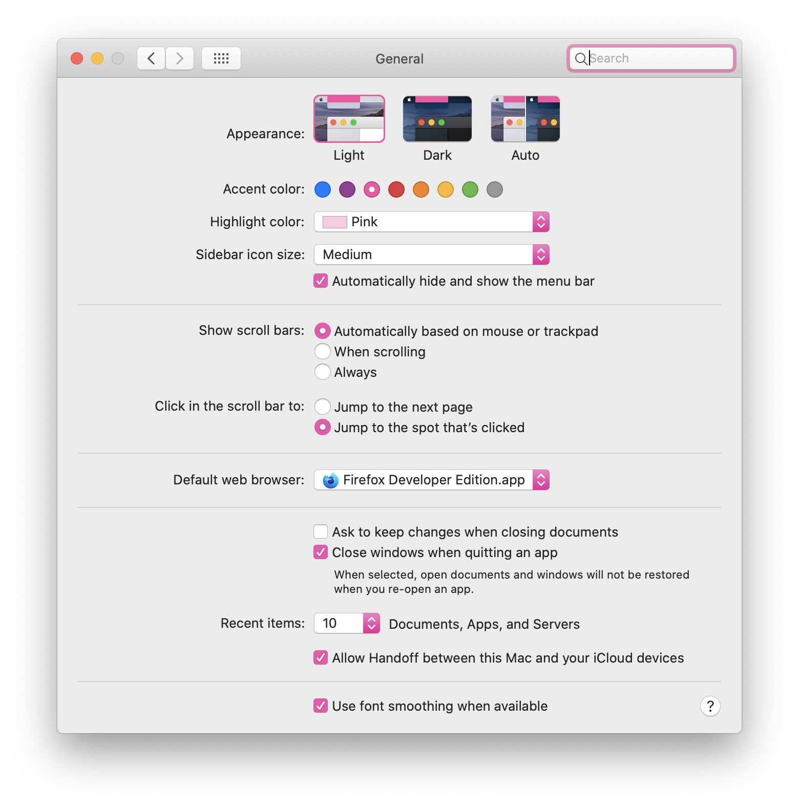
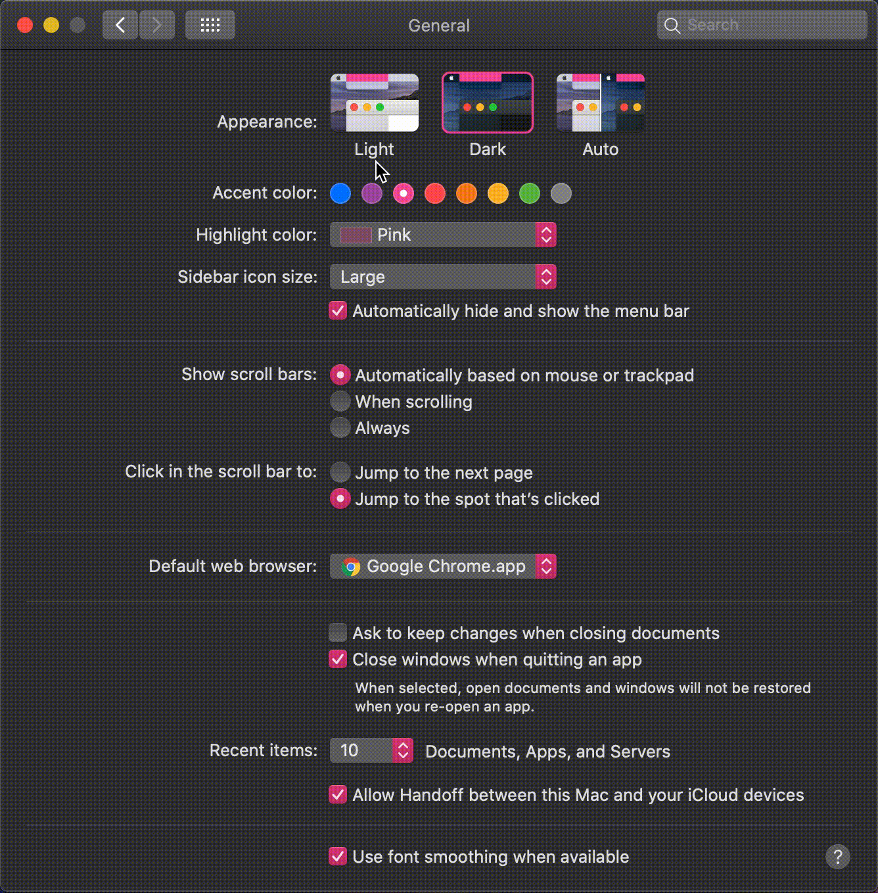

    <a href="https://github.com/willbchang/macos/blob/master/system-preferences/general.sh">general.sh</a>

## Appearance
- **Default Value: Light**
- **Preferred Value: Auto**

Choose the appearance for buttons, menus, and windows on your Mac.

**Dark** provides a darkened appearance so the content you’re working on stands out while windows and controls seem to recede into the background. It’s effective for viewing documents, presentations, photos, movies, webpages, and more.

**Auto** automatically adjusts the appearance from light to dark during the day.

## Accent Color
- **Default Value: Blue**
- **Personal Recommend: Pink**

Accent colors change UI elements such as app menus, popup menus, radio buttons, focus fields, and more. [1][accent-color]

## Highlight Color
- **Default Value: Blue**
- **Personal Recommend: Pink**

Highlight the text you selected.

## Sidebar Icon Size: 
- **Default Value: Medium**
- **Personal Recommend: Large(for 16"+ display)**

Finder's sidebar icon size.

## Hide/Show Menu Bar: 
- **Default Value: Unchecked**
- **Personal Recommend: Checked**

Automatically hide and show the menu bar. 
- Move the cursor on the top of the screen.
- Use <kbd>ctrl</kbd> + <kbd>F8</kbd> to focus on menu bar.

## Show Scroll Bars: 
- **Default Value: unchecked**
- **Preferred Value: checked**
- **Personal Recommend: **

## Click in The Scroll Bar to: 
- **Default Value: unchecked**
- **Preferred Value: checked**
- **Personal Recommend: **

## Default Web Browser: 
- **Default Value: unchecked**
- **Preferred Value: checked**
- **Personal Recommend: **

## Ask to keep changes when closing 
documents: **

## Close windows when quitting an App: 
- **Default Value: unchecked**
- **Preferred Value: checked**
- **Personal Recommend: **

## Recent items: 
- **Default Value: unchecked**
- **Preferred Value: checked**
- **Personal Recommend: **

## Handoff: 
- **Default Value: unchecked**
- **Preferred Value: checked**
- **Personal Recommend: **

## Font Smoothing: 
- **Default Value: unchecked**
- **Preferred Value: checked**
- **Personal Recommend: **

[accent-color]: https://9to5mac.com/2018/06/27/macos-mojave-how-to-adjust-the-system-accent-color/#:~:text=Accent%20colors%20change%20UI%20elements%20such%20as%20app%20menus%2c%20popup%20menus%2c%20radio%20buttons%2c%20focus%20fields%2c%20and%20more
